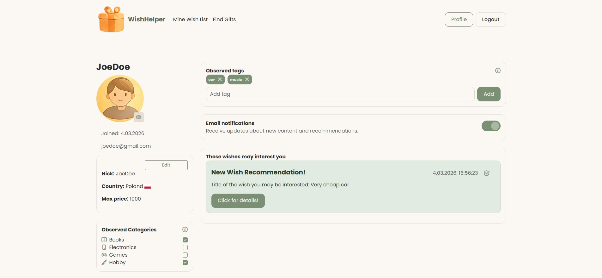
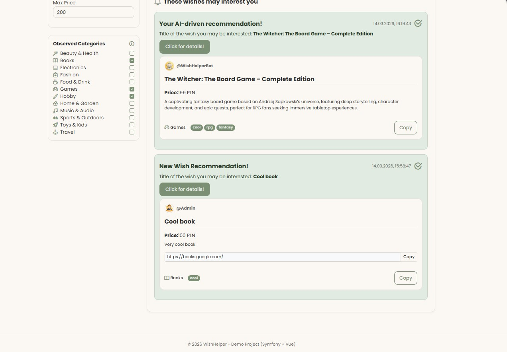
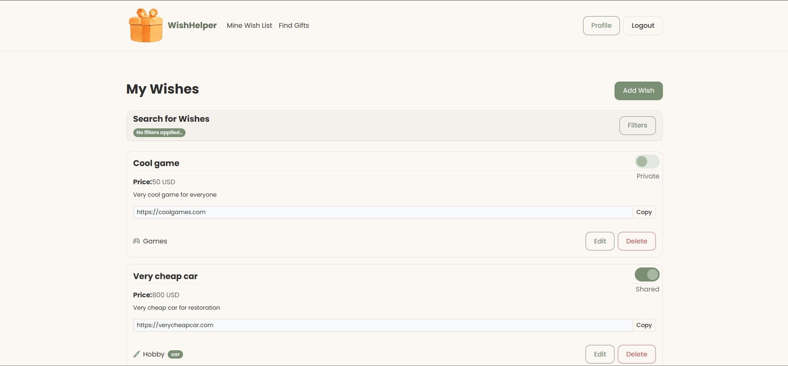
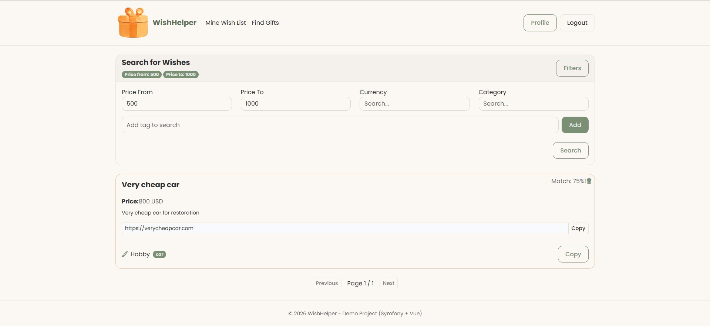

# Wish Helper
WishHelper is a web application designed for managing personal wishlists and discovering gift ideas based on other users' interests. Built with Symfony 6.4, API Platform, Twig, and Vue 3, it offers full user authentication, email verification, and profile management including categories, tags, and country selection. Users can create, edit, share, and view their own wish items with attributes like title, description, category, tags, price, currency, and link. The frontend provides dynamic forms and interactive lists, synchronized with backend stores via Pinia.

The application includes a wish search feature with a match algorithm that scores items by category, tags, and price constraints. Redis caching improves performance, and all operations respect security rules with ownership checks, CSRF protection, and rate limiting.

## Alpha
The Alpha version focuses on building a stable technical foundation for future development. At this stage, the application implements a secure authentication system, a structured domain model, and a fully functional API layer prepared for wishlist management and matching logic. This phase prioritizes architecture, security, and extensibility over advanced integrations.

## Preview

# CHANGELOG.md
Look at the CHANGELOG.md to see what has been added!

# First start
run DockerDesktop
run in command line next commands:
* `docker-compose up -d --build` - second time use `docker-compose up`
* `docker-compose exec php /bin/bash`
* `symfony check:requirements`
* `composer install`
* `yarn install` to install yarn and nodejs if not exists
* `yarn run watch` to compile assets whenever changes are made
* `yarn run dev` to compile assets once
* Open: http://localhost:8080/
* For api open: http://localhost:8080/api
* For docs open: http://localhost:8080/api/docs

# Better performance
* for performance issue with WSL2 in docker-desktop vendor directory is not in volumes, you have to set volumes in php container as below and run composer install in container!
  *  `- /var/www/project/vendor # ignore vendor folder`
* also remember to disable XDEBUG - look at .env file

## prepare database
* `php bin/console doctrine:database:create` to create database on docker-compose basics
* `php bin/console doctrine:migration:migrate`
* `php bin/console doctrine:fixtures:load` to fill the database

additionally after changes run `symfony console make:migration` and then `symfony console doctrine:migration:migrate`

### link database to phpstorm:
We have to create new data source with mysql. Then in properties we added some config:
* Host: `localhost`
* Port: `4306`
* User: `wh_admin`
* Password `wh_tester`
* Database `wh_database`

## Integration
At this moment, the Wish Helper app supports currency integration. To start the integration and update currencies, run the following command in the container:
The integration works via queuing using messenger + RabbitMQ. 
Additionally, you should check the configuration for cron, which runs integrations at specific intervals, while the worker container consuming messages.

`php bin/console app:currency-integration USD,EUR,PLN`
where currencies separated by commas are optional. The basis for calculations is USD.
Another integration is fetching countries via SOAP. To start the integration and update countries, run the following command in the container:
`php bin/console app:country-integration US,DE,PL`
where countries ISO codes separated by commas are optional.

## In main directory we create docker-compose.yml file to config our containers for MySql, PHP, Nginx and Redis
### PHP
we create docker/php directory with Dockerfile with configuration where we:
* PHP  is mapped on - '9000:9000'
* Install the PHP extensions Symfony depends on.
* Set the working directory of the container to /var/www/project
* Install composer
* Install the Symfony CLI
* Installed npm, nodejs, yarn for encore
### Nginx
* We create nginx container that is mapped on - '8080:80'
* Nginx container has configuration in directory docker/nginx where we add listening on 80, 
* we also set index of our symfony project (index.php), server_name "localhost" and root for public: /var/www/project/public;
### MySql
* MySql in version 8.0, with pass and database env.
* MySql is mapped on - '4306:3306'
### php-stan and php-cs-fixer:
* we added phpstan/phpstan and friendsofphp/php-cs-fixer to dev require in composer.json with scripts
* remember to copy phpstan.neon and .php-cs-fixer.dist.php without dist part in names.
* to run phpstan: `composer quality` (possible add path after quality to check only specific directory)
* to run php-cs-fixer: `composer style-fix src --dry-run` (remove --dry-run to fix issues, also it is possible to add path to check/fix only specific directory)
* if a memory issue with phpstan occurs you can increase memory limit by changing --memory-limit in composer.json
* phpstan level is set to 6
